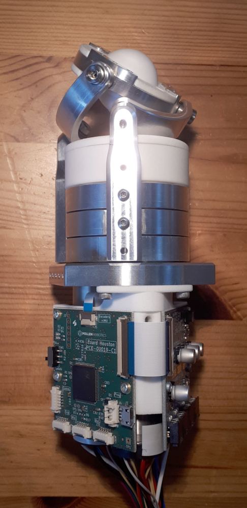
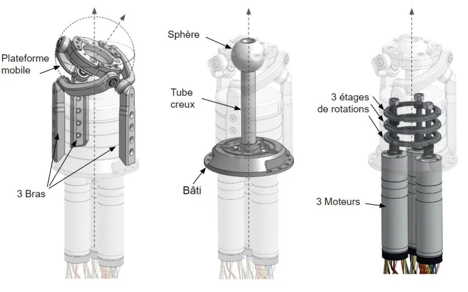

# Orbita_3d_R1
All you need to make your own Orbita_3d Joint!

## Basically
Please find:
 - Electronic boards that controls (elec_Houston), drives (elec_Major_Tom) and measures (elec_Pacman) the Orbita 3d Joint over 12V-supplied Dynamixel bus.
 - Firmware gather communication (Dynamixel library) and motor control (SimpleFOC library)
 - Cables

## Licences
 - Firmware is under Apache-2.0 licence
 - Electronic/Cables is under CC-BY-SA-NC Licence

## Patents
https://patents.google.com/patent/FR3141363A1

## Contact
contact@pollen-robotics.com
