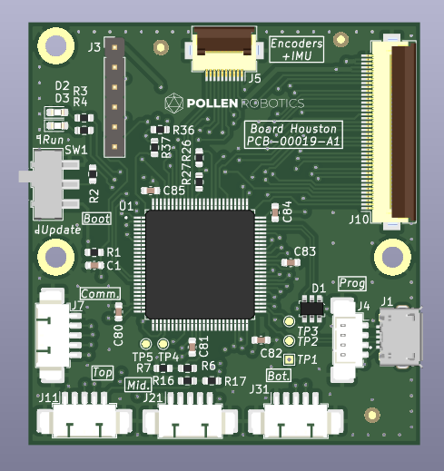
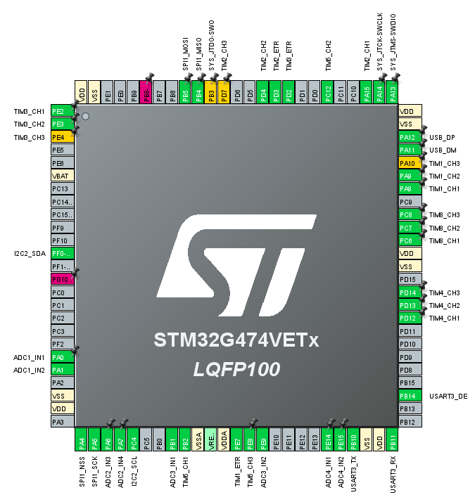

# Houston Electronic Board

Houston board is basically a STM32G4 microcontroller that focuses on driving 3 BLDC motors. It gets 3 Hall effects or encoders on motors and absolute positions behind reduction through SPI encoders.

## Basically
 - 50 x 54 mm
 - Powered in 3V3 through the large flat flexible connector J10
 - 5V should also be provided since it supplies encoders J11/21/31
 - Designed with KiCAD 6.0

## ST configuration

