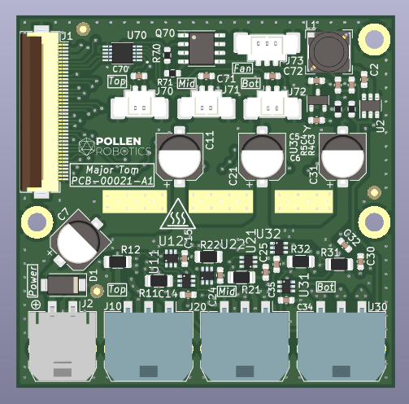

# Major Tom Electronic Board

Major Tom is a power board driving 3 BLDC motors. It also add 3 temperature measurements and a fan control.

## Basically
 - 55 x 54 mm
 - Powered in 12V or in 24V.
 - Drive 3 BLDC motors with DRV8313 (2,5 A peak)
 - Designed with KiCAD 6.
