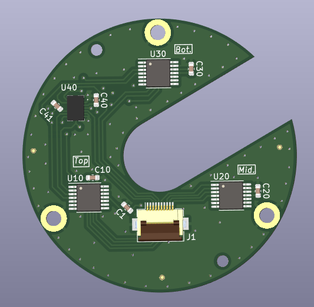

# Pacman Electronic Board

Pacman board gathers 3 absolute encoders with an IMU. It is set at the top of the Orbita system and sends angular positions of the 3 axis + IMU data. It is connected to the Houston board through a FFC.

## Basically
 - 49 mm diameter with a 13 mm slot
 - Powered in 3V3
 - Common SPI, differents CS pins.

## Notas
 - all components are on the bottom side since the encoders are facing down the motors.

